

  

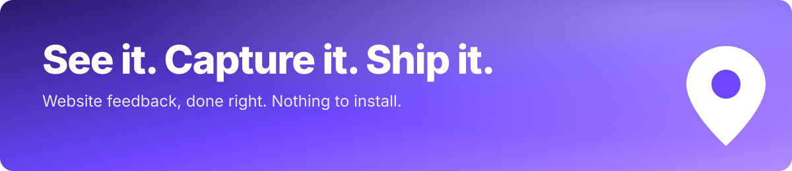

### Website feedback, done right.

**Pin comments on any live website. Every pin captures the screenshot, CSS selector, viewport, console logs and network requests, then hands it to Claude Code or Cursor over MCP. Nothing to install.**

 

 

<a href="https://layerdock.io">
  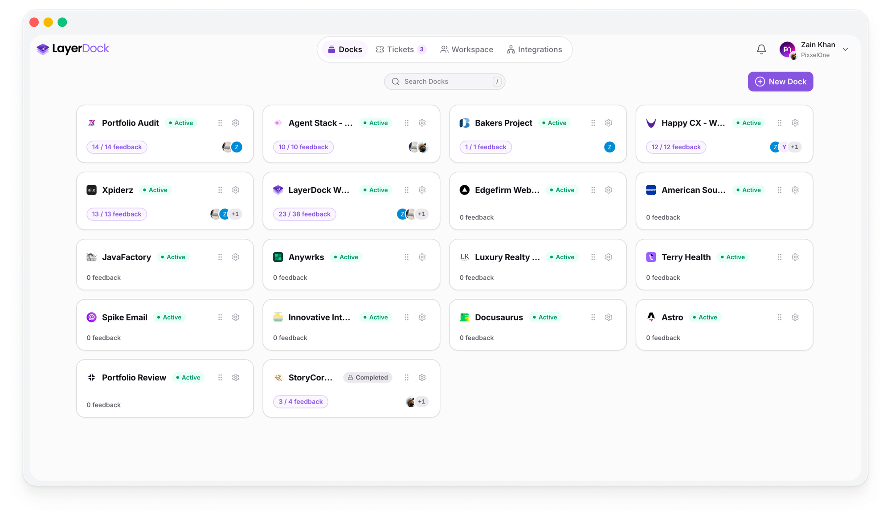
</a>

---

## What is LayerDock?

A browser-based website feedback and visual bug reporting tool for agencies, freelancers, product teams and QA.

Your client opens a link, clicks the thing that is wrong, and types what they want. You get everything a developer needs to fix it, without a single "can you send me a screenshot?" email.

> **See it. Capture it. Ship it.**

---

## Features

### 📍 Pin comments on the live site

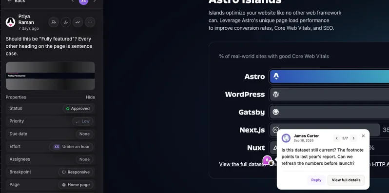

Pins stick to the element, not the pixel, and re-anchor after redeploys. Reviewers switch between desktop, tablet and mobile without leaving the page.

### 🤖 Context captured automatically

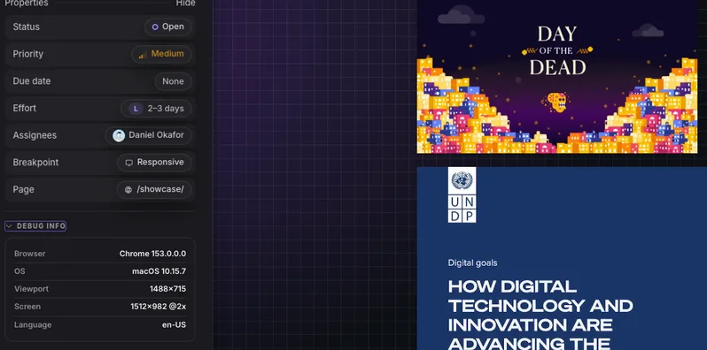

Screenshot · CSS selector · viewport · console logs · network requests · browser and OS. Recorded on every pin, so the first reply is never "which browser?".

### 🔌 Hand pins to your coding agent

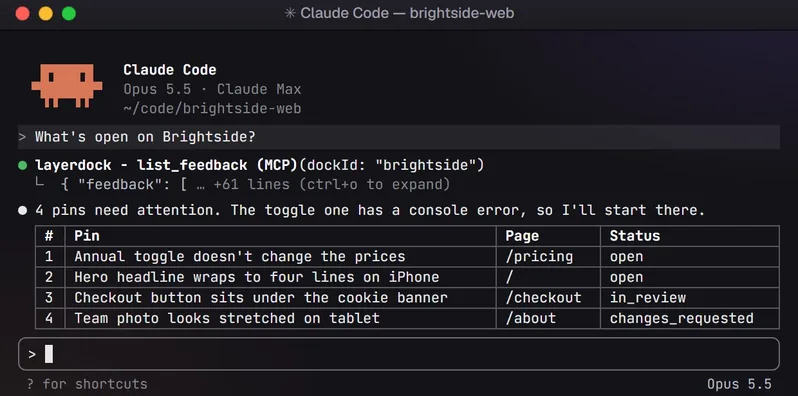

The LayerDock MCP server lets **Claude Code** and **Cursor** list a dock's pins, read the selector, screenshot and console trace, reply, and move a pin to resolved.

### ✏️ Draw, record and inspect

<table>
<tr>
<td width="33%" valign="top">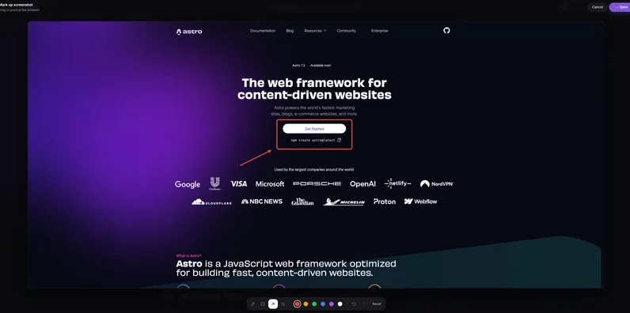 <b>Draw</b> Pen, arrow, highlight, text, eraser.</td>
<td width="33%" valign="top">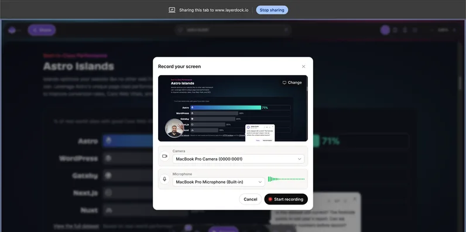 <b>Record</b> Screen recordings up to 3 minutes, plus a rolling 60 second dashcam.</td>
<td width="33%" valign="top">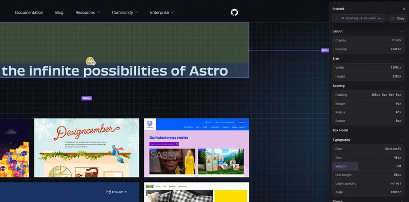 <b>Inspect</b> Element details and in-browser accessibility checks.</td>
</tr>
</table>

### 🔗 Share with clients, no account needed

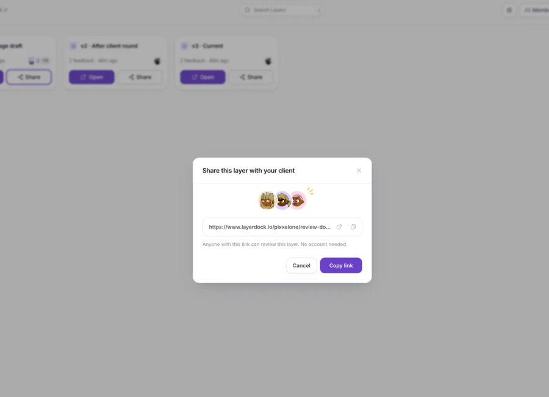

Clients review through a link. They never sign up, and your internal team notes stay private. Each client sees only their own pins.

---

## How it works

<table>
<tr>
<td width="33%" valign="top">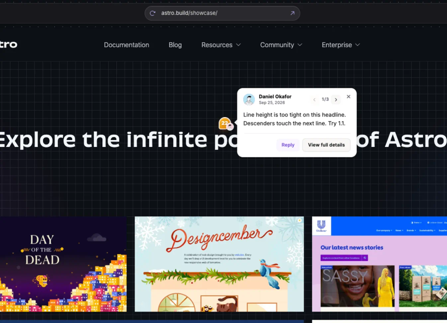 <b>1. See it</b> Open the review link, pick a viewport, click anything on the page.</td>
<td width="33%" valign="top">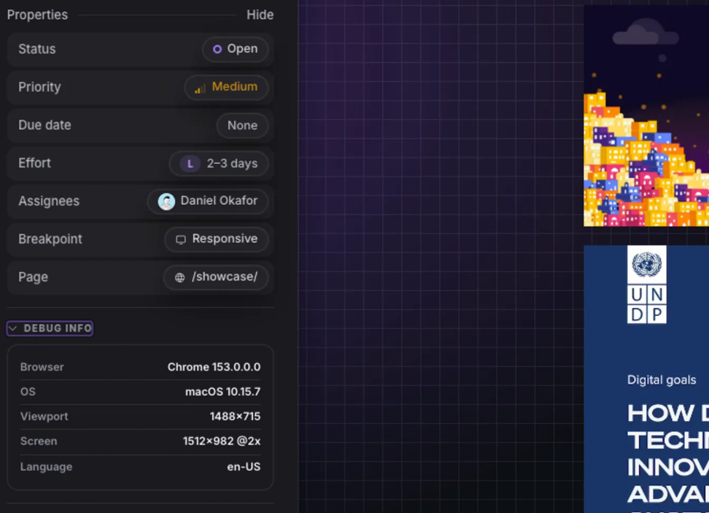 <b>2. Capture it</b> Comment, draw or record. The screenshot, selector and logs attach themselves.</td>
<td width="33%" valign="top"> <b>3. Ship it</b> Triage, assign, or hand the pin to Claude Code or Cursor to fix.</td>
</tr>
</table>

Set up: **create a dock** (one website), **add a layer** (a draft or build), **share the link**. Pins move through Open, In review, Changes requested, Approved and Resolved.

Want to see it first? Paste any URL at [layerdock.io/try](https://layerdock.io/try) and get a working review link, no account.

---

## Everything else

- **Multi-viewport:** desktop, tablet, mobile, free roam
- **Integrations:** Slack, Jira, Linear, GitHub, Trello
- **Team roles and permissions:** who can edit, assign and invite
- **Email digests:** batched, never one email per pin
- **Layerdock for Chrome:** optional launcher for Pro and Agency, adds a dock from the site you are on

---

## Pricing

| Plan | Price | Highlights |
| --- | --- | --- |
| **Free** | $0 forever | 2 docks, 35 feedback submissions per month, client share link on 1 dock, no credit card |
| **Pro** | $15/mo yearly · $19/mo monthly | 5 docks, unlimited feedback, 7 team members, screen recording, integrations, MCP |
| **Agency** | $59/mo yearly · $69/mo monthly | Unlimited docks, 20 team members, diagnostics on every pin, full-context MCP, team permissions |

Paid plans start with a 14 day free trial. Current prices are always at [layerdock.io](https://layerdock.io/#pricing).

---

## Who is it for?

Web design agencies · freelancers · product teams · QA · Framer, Webflow and WordPress teams · engineering teams using Claude Code or Cursor.

Looking for a **BugHerd**, **Marker.io**, **MarkUp.io** or **Jam** alternative? LayerDock captures developer context automatically on every pin.

---

## FAQ

**Do I need to install anything?** No. It runs in the browser.

**Do clients need an account?** No. They use a share link.

**What is captured with each comment?** Screenshot, CSS selector, viewport, console logs, network requests, browser and OS.

**Can I send feedback to my coding agent?** Yes, through MCP with Claude Code or Cursor.

---

[**layerdock.io**](https://layerdock.io) · [Try it free](https://layerdock.io/try) · [Indie Hackers](https://www.indiehackers.com/product/layerdock)

© LayerDock. This repository hosts the public project page; the product is closed source.

